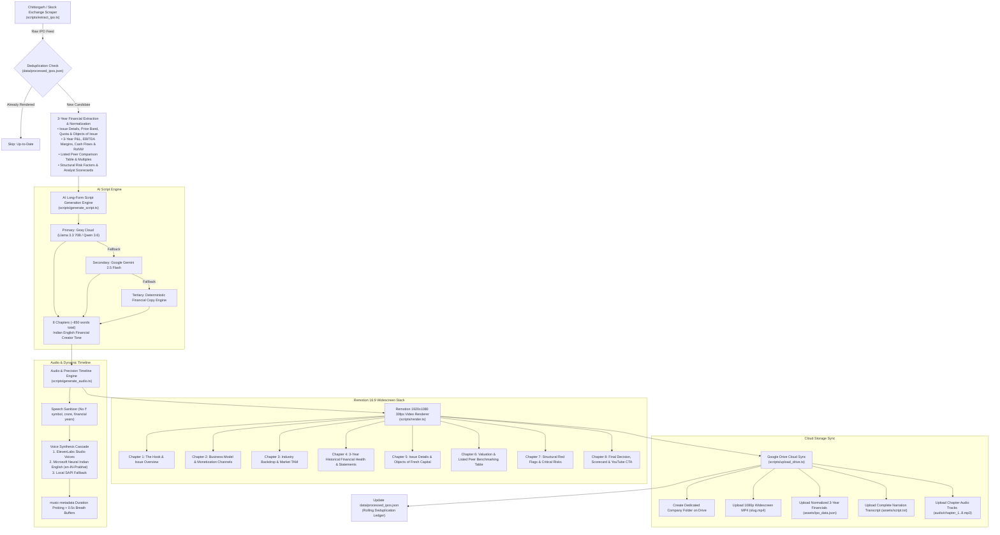
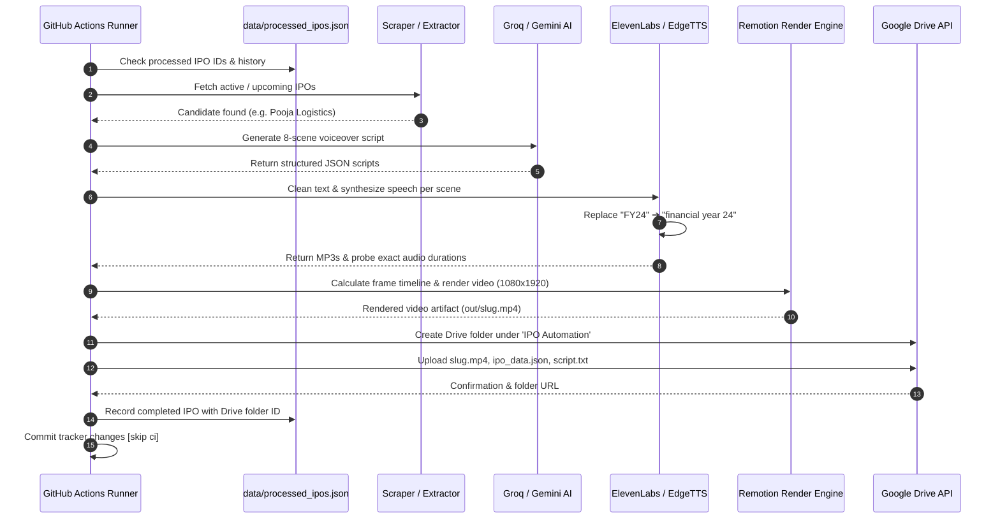

# 🎬 Autonomous Long-Form IPO Video Deep-Dive Engine

[](https://remotion.dev)
[](https://elevenlabs.io)
[](https://groq.com)
[](https://developers.google.com/drive)
[-red?logo=youtube)](https://youtube.com)

An industrial-grade, fully autonomous financial video automation system engineered for full-length YouTube deep dives (16:9 Landscape, 1920×1080, 4–6 minutes). It automatically discovers active and upcoming Indian Initial Public Offerings (IPOs), extracts 3-year historical financial metrics and peer valuation multiples, generates high-retention narration scripts in Indian English, synthesizes studio-grade voiceover audio, renders 1920×1080 widescreen animations with frame-accurate timeline synchronization, and archives production-ready assets to Google Drive.

---

## 🏗️ 1. System Architecture



---

## ⏱️ 2. Execution Sequence Diagram



---

## 🎬 3. Video Composition Breakdown (8 Dynamic Scenes)

Every generated video is built for **1080×1920 30fps vertical video format** (YouTube Shorts, Instagram Reels, TikTok) with dynamic scene durations calculated from speech audio:

| Scene | Name | Purpose | Target Word Count | Visual Animation Elements |
| :--- | :--- | :--- | :--- | :--- |
| **0** | **Hook** | Grab attention in first 2 seconds | 16–18 words | High-contrast company badge, glowing issue size counter, *"Apply or Avoid?"* pill badge |
| **1** | **Basics** | Issue size, price band & lot size | 18–21 words | Staggered metrics cards, lot size breakdown, minimum investment badge |
| **2** | **Growth** | Topline revenue expansion | 18–21 words | Spring-animated dual vertical bar chart comparing Period 1 vs Period 2 + CAGR badge |
| **3** | **Profitability** | PAT & cash burn reality check | 18–21 words | Profit/loss status alert, PAT counter card, caution item callouts |
| **4** | **Valuation** | Price-to-Earnings & Peer multiples | 18–21 words | Valuation dial, P/E multiple card, comparison with listed industry peers |
| **5** | **Risks** | Top red flags retail investors miss | 20–24 words | Warning triangle alert, staggered cards for Top 3 risks |
| **6** | **My Take** | Objective analyst evaluation | 22–26 words | Analyst recommendation badge, listing gain probability, execution risk summary |
| **7** | **Verdict** | Final conclusion & CTA | 28–34 words | Verdict stamp (Apply / Caution / Avoid), GMP warning, animated subscribe button |

---

## ⚙️ 4. Local Setup Guide

### Prerequisites
* **Node.js**: `v20.x` or higher
* **FFmpeg**: Required for audio probing and video concatenation
* **Google Cloud Project**: With Google Drive API enabled and OAuth2 credentials

### 1. Clone & Install Dependencies
```bash
git clone https://github.com/rajnishkumar13500/animation-automation-ipo.git
cd animation-automation-ipo
npm install
```

### 2. Configure Environment Variables
Create a `.env` file in the root directory:
```env
# ─── Groq Cloud AI (Script Generation) ───────────────────────────────────
GROQ_API_KEY=gsk_your_groq_api_key
GROQ_MODEL=qwen/qwen3.6-27b

# ─── Google Gemini (Secondary Script Fallback) ───────────────────────────
GEMINI_API_KEY=your_gemini_api_key
GEMINI_MODEL=gemini-2.5-flash

# ─── Voice Synthesis (ElevenLabs with Multi-Key Failover) ────────────────
ELEVENLABS_API_KEY_1=your_first_elevenlabs_key
ELEVENLABS_API_KEY_2=your_second_elevenlabs_key
ELEVENLABS_VOICE_ID=pNInz6obpgDQGcFmaJgB
ELEVENLABS_MODEL_ID=eleven_multilingual_v2

# ─── Google Drive Cloud Sync ─────────────────────────────────────────────
GDRIVE_CLIENT_ID=your_oauth_client_id.apps.googleusercontent.com
GDRIVE_CLIENT_SECRET=your_oauth_client_secret
GDRIVE_REFRESH_TOKEN=your_google_drive_refresh_token
GDRIVE_PARENT_FOLDER_ID=your_parent_folder_id_on_drive

# ─── Video & Audio Configuration ─────────────────────────────────────────
BG_MUSIC_VOLUME=0.04
```

### 3. Authorize Google Drive (1-Click OAuth)
```bash
npm run auth:drive
```
Open the generated link in your browser, approve Drive permissions, and the script will automatically write `GDRIVE_REFRESH_TOKEN` to your `.env` file!

---

## 🛠️ 5. CLI Commands Reference

| Command | Action |
| :--- | :--- |
| `npm run dev` | Launches the interactive **Remotion Studio** web preview on `http://localhost:3000` |
| `npm run pipeline` | Runs the entire end-to-end automation (scrape ➔ script ➔ audio ➔ render ➔ upload Drive) |
| `npm run extract` | Scrapes Chittorgarh / exchanges and updates IPO dataset in `src/data/[slug].json` |
| `npm run script` | Runs Groq / Gemini AI script generation for candidate IPO |
| `npm run audio` | Synthesizes voiceover MP3s and recalculates dynamic frame timeline |
| `npm run render` | Renders the final 1080×1920 MP4 video to `out/[slug].mp4` |
| `npm run upload:drive` | Syncs the rendered video and asset bundle to Google Drive |
| `npm run auth:drive` | Launches local OAuth server to authenticate Google Drive |
| `npm run test:drive` | Verifies Google Drive credentials and folder write access |

---

## 🤖 6. GitHub Actions Cloud Automation

The workflow in [`.github/workflows/ipo_automation.yml`](.github/workflows/ipo_automation.yml) runs **twice daily, 7 days a week**:

* **Morning Run**: `03:00 UTC` (**08:30 AM IST**)
* **Evening Run**: `13:30 UTC` (**07:00 PM IST**)
* **Manual Dispatch**: Triggerable anytime on-demand with custom IPO slug or automatic discovery.

### Ubuntu 24.04 Cloud Dependencies
The GitHub Actions workflow includes automated headless Chromium installation, `xvfb` virtual display server, audio drivers (`libasound2t64`), and FFmpeg for reliable cloud rendering.
