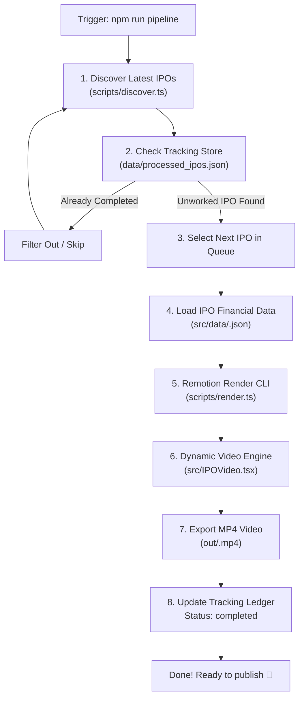

# IPO Automation Pipeline — Workflow

This document explains the automated workflow for discovering IPOs, preventing duplicate video creation, and rendering dynamic Remotion videos.

---

## 1. End-to-End Pipeline Flow

---

## 2. Core Stages Explained

### Stage 1: Discovery (`scripts/discover.ts`)
- Scans live IPO feeds (e.g. RSS feed from IPO Watch).
- Cleans and normalizes company names (e.g., strips out "Review by Dilip Davda", "Subscription Status").
- Generates a unique URL-friendly slug (e.g., `acevector`).

### Stage 2: Deduplication Tracking (`scripts/tracker.ts`)
- Reads [`data/processed_ipos.json`](./data/processed_ipos.json).
- Checks whether the IPO has already been rendered.
- If it has already been processed, it is automatically skipped so no company is ever rendered twice.

### Stage 3: Data Schema & Storage (`src/types/ipo.ts`)
- Uses the standardized `IPOData` schema containing:
  - **Issue Details**: Total size, fresh issue, OFS, price band, lot size, min amount.
  - **Growth Metrics**: Revenue comparison (FY vs FY), CAGR %.
  - **Profitability**: PAT, margins, caution notes.
  - **Valuation**: P/E ratio comparison vs peer median.
  - **Risks**: Top 3 structural risk items.
  - **My Take**: Fundamentals scorecard and suggestion.
  - **Verdict**: Positives vs concerns and call to action.
- Data files live in [`src/data/<slug>.json`](./src/data/).

### Stage 4: Dynamic Video Render (`src/IPOVideo.tsx`)
- Remotion CLI renders the video using `--props="src/data/<slug>.json"`.
- [`src/IPOVideo.tsx`](./src/IPOVideo.tsx) resolves the CLI props with highest priority over default fallbacks.
- Outputs a 1080×1920 vertical video (9:16) to [`out/<slug>.mp4`](./out/).
- Marks the IPO as `completed` with timestamp in [`data/processed_ipos.json`](./data/processed_ipos.json).

---

## 3. How to Run

| Task | Command |
|---|---|
| **View all unworked IPOs** | `npm run discover` |
| **Render next unworked IPO** | `npm run pipeline` |
| **Render specific IPO** | `npm run pipeline -- --ipo=<slug>` |
| **Preview scenes in browser** | `npm run dev` |
| **Check code quality & types** | `npm run lint` |
