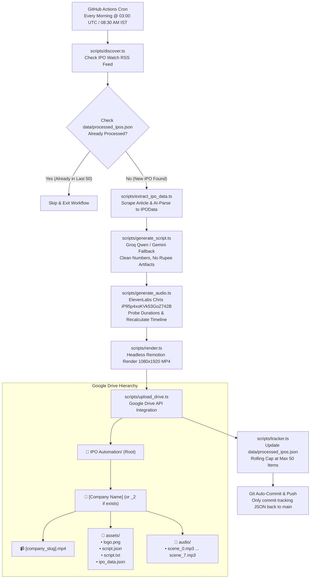

# End-to-End Autonomous IPO Video Pipeline & Cloud Delivery Plan

## 1. Executive Summary & Architecture Overview

This plan establishes a **100% autonomous, headless video generation and cloud distribution pipeline** running on **GitHub Actions**. Every morning, the system checks for newly listed/announced Indian IPOs, automatically extracts their financial and subscription metrics, generates punchy narration scripts, synthesizes studio-grade voiceover audio using ElevenLabs (voice `iP95p4xoKVk53GoZ742B` / Chris), renders high-definition vertical MP4 videos with Remotion, and archives all outputs directly to **Google Drive** in an organized hierarchy.



---

## 2. Ephemeral Storage Strategy (Answering Your Question)

> **User Question**: *"as this will be git hub action so we dont actaully need to clean the out folder of public folder right?"*

**Yes, absolutely correct!** 

1. **Ephemeral Virtual Machines**: GitHub Actions runners run on disposable Ubuntu virtual machines. Each workflow run starts on a clean slate and is completely wiped the moment the job finishes.
2. **Zero Git Bloat**: Heavy video files (`.mp4`, 10MB+) and intermediate audio scenes (`.mp3`) exist **only** in runner temporary storage while the workflow runs. They are pushed directly to Google Drive and **never committed to Git**.
3. **Repository Cleanliness**: The only file that ever gets committed back to the Git repository by the automated workflow is [`data/processed_ipos.json`](file:///d:/Remotion/Automation/data/processed_ipos.json) (<15 KB), ensuring the repository remains fast to clone, lightweight, and well within GitHub repository size quotas.

---

## 3. Google Drive Architecture & Step-by-Step Setup Guide

To upload files autonomously without human intervention or expiring login screens, we will use a **Google Cloud Service Account** with the Google Drive API (`googleapis`). 

### How Google Drive Upload Works
1. A Google Cloud Service Account has an email address (e.g. `ipo-bot@your-project.iam.gserviceaccount.com`).
2. You create a folder in your personal or team Google Drive named **`IPO Automation`**.
3. You share that folder with the Service Account email address and grant it **Editor** permissions.
4. When the script runs, it uses the Service Account credentials to create folders and upload files inside that designated parent folder.

### Step-by-Step Guide for the User:

#### Step 1: Create a Google Cloud Project & Enable Drive API
1. Navigate to the [Google Cloud Console](https://console.cloud.google.com/).
2. Create a new project (e.g., `IPO-Automation-Video`).
3. In the search bar at the top, type **Google Drive API** and click **Enable**.

#### Step 2: Create a Service Account
1. Go to **IAM & Admin** > **Service Accounts**.
2. Click **+ Create Service Account**.
3. Service account name: `ipo-uploader` -> Click **Create and Continue** -> Click **Done**.

#### Step 3: Generate the Service Account JSON Key
1. Click on the newly created service account email in the list.
2. Go to the **Keys** tab -> Click **Add Key** > **Create new key**.
3. Choose **JSON** format and click **Create**. A `.json` file will automatically download to your computer.
4. Copy the entire contents of this downloaded `.json` file (you will paste this into GitHub Secrets).
5. Note the `client_email` inside the JSON (e.g., `ipo-uploader@...iam.gserviceaccount.com`).

#### Step 4: Create the Root Folder in Google Drive & Share
1. Open [Google Drive](https://drive.google.com/).
2. Create a new folder named **`IPO Automation`**.
3. Open the folder and check its URL in the browser:
   ```
   https://drive.google.com/drive/folders/1a2b3c4d5e6f7g8h9i0jKlMnOpQrStUvW
   ```
   The string after `/folders/` (`1a2b3c4d5e6f7g8h9i0jKlMnOpQrStUvW`) is your **`GDRIVE_PARENT_FOLDER_ID`**.
4. Right-click the **`IPO Automation`** folder > **Share**.
5. Paste the Service Account's `client_email` from Step 3.
6. Set the role to **Editor** and uncheck "Notify people" -> Click **Share**.

---

## 4. Google Drive Folder & Asset Organization

For each processed IPO, the upload script will build the following structure inside `GDRIVE_PARENT_FOLDER_ID`:

```
📁 IPO Automation (Parent Folder ID)
└── 📁 [Company Name] (e.g., "Money View" or "Money View_2" if exists)
     ├── 📹 [slug].mp4               (Full 1080x1920 30fps vertical video)
     ├── 📁 assets/
     │    ├── logo.png               (High-res company logo/icon)
     │    ├── script.json            (Structured 8-scene scripts with timing data)
     │    ├── script.txt             (Human-readable narration transcript)
     │    └── ipo_data.json          (Full raw financial & subscription dataset)
     └── 📁 audio/
          ├── scene_0.mp3            (Hook audio)
          ├── scene_1.mp3            (Issue breakdown audio)
          ├── scene_2.mp3            (Growth metrics audio)
          ├── scene_3.mp3            (Profitability audio)
          ├── scene_4.mp3            (Valuation audio)
          ├── scene_5.mp3            (Strengths audio)
          ├── scene_6.mp3            (Risks audio)
          └── scene_7.mp3            (Conclusion & call to action audio)
```

### Collision Handling Algorithm:
1. Search the parent folder for any subfolder with the title equal to `companyName`.
2. If no folder exists, create `companyName`.
3. If a folder with `companyName` exists, probe `companyName_2`, `companyName_3`, etc., until an unused folder name is confirmed.
4. Create the target company folder and immediately create the two subfolders: `assets` and `audio`.
5. Upload all files into their respective subfolders using parallel streaming for maximum speed.

---

## 5. Rolling 50-Item FIFO Tracker Specification

To prevent `data/processed_ipos.json` from growing indefinitely or maintaining stale duplicate records, the tracking module will enforce a strict **sliding window of the last 50 processed IPOs**.

### Key Rules:
1. **Deduplication Check**: Before running the pipeline, normalize company names and slugs (`acevector` == `ACEVECTOR` == `ace-vector`). If present in the tracking file with `status === "completed"`, skip.
2. **Atomic Record Upsert**:
   - If an entry with the same normalized ID already exists, update its record in place.
   - If it is a new IPO, prepend the entry to the front of `history`.
3. **50-Item FIFO Slice**:
   ```typescript
   store.history = store.history.slice(0, 50);
   ```
4. **Metadata Preservation**: Keep essential metadata in each record for auditability:
   - `id`: Slug (e.g., `moneyview`)
   - `companyName`: Display name (e.g., `MONEY VIEW`)
   - `listingDate`: IPO listing date
   - `status`: `completed` | `in_progress` | `failed`
   - `processedAt`: ISO 8601 timestamp
   - `driveFolderUrl`: Direct Google Drive web link to the created folder
   - `videoFileName`: Name of the uploaded MP4

---

## 6. Automated IPO Data Extractor (`scripts/extract_ipo.ts`)

Currently, `pipeline.ts` assumes `src/data/<slug>.json` already exists. For true hands-off automation, we will implement an automatic data extraction layer:

1. When `discover.ts` detects a new IPO URL from the RSS feed (e.g. on `ipowatch.in`):
   - Fetch the raw article HTML using `fetch()`.
   - Extract key financial tables: Issue size, Fresh vs OFS, Price band, Lot size, Revenue numbers, PAT/Profitability, Listing date, Strengths & Risks.
2. **AI Metric Structuring**:
   - Send the extracted text to Groq (`qwen/qwen3.8-27b` / `llama-3.3-70b-versatile`) with a strict JSON schema prompt mapping directly to the TypeScript `IPOData` interface.
   - Fallback to Gemini 2.5 Flash if Groq hits rate limits.
3. **Company Logo / Favicon Retrieval**:
   - Automatically determine the company's official domain or brand favicon (`https://www.google.com/s2/favicons?domain=...&sz=256`).
4. Save the generated `src/data/<slug>.json` automatically and proceed immediately to scripting, voiceover, and video rendering.

---

## 7. GitHub Actions Workflow Design (`.github/workflows/ipo_automation.yml`)

### Workflow Configuration:
- **Triggers**:
  1. **Schedule**: `cron: '0 3 * * 1-5'` (Runs Monday–Friday at 03:00 UTC / 08:30 AM IST).
  2. **Manual Dispatch**: `workflow_dispatch` allowing manual runs with custom inputs (e.g., specific `--ipo`, custom voice, or force re-generation).
- **Runner Environment**: `ubuntu-latest` (GitHub-hosted Linux VM).
- **Headless Chrome & Remotion Support**:
  - Remotion requires Chromium for rendering frame animations.
  - Install OS-level graphics and sandbox libraries: `libasound2 libatk-bridge2.0-0 libgtk-3-0 libnss3 libxss1`.
  - Alternatively, use `npx remotion install-chrome`.

### GitHub Action Workflow File Outline:
```yaml
name: Scheduled IPO Video Automation

on:
  schedule:
    # 1) Morning run: 08:30 AM IST (03:00 UTC) - Every day (7 days a week)
    - cron: '0 3 * * *'
    # 2) Evening run: 07:00 PM IST (13:30 UTC) - Every day (7 days a week)
    - cron: '30 13 * * *'

  workflow_dispatch:
    inputs:
      ipo_slug:
        description: 'Specific IPO slug to process (leave blank for automatic discovery)'
        required: false
        default: ''
      force_render:
        description: 'Force re-render even if already processed'
        type: boolean
        default: false
      voice_id:
        description: 'ElevenLabs Voice ID (default: Chris iP95p4xoKVk53GoZ742B)'
        required: false
        default: 'iP95p4xoKVk53GoZ742B'

jobs:
  run-pipeline:
    runs-on: ubuntu-latest
    timeout-minutes: 30

    steps:
      - name: Checkout Code
        uses: actions/checkout@v4
        with:
          token: ${{ secrets.GITHUB_TOKEN }}
          fetch-depth: 1

      - name: Setup Node.js
        uses: actions/setup-node@v4
        with:
          node-version: 20
          cache: 'npm'

      - name: Install System Dependencies for Remotion / Chromium
        run: |
          sudo apt-get update
          sudo apt-get install -y libnss3 libatk1.0-0 libatk-bridge2.0-0 libcups2 libdrm2 libxkbcommon0 libxcomposite1 libxdamage1 libxfixes3 libxrandr2 libgbm1 libasound2

      - name: Install NPM Dependencies
        run: npm ci

      - name: Run IPO Video Pipeline & Cloud Upload
        env:
          GROQ_API_KEY: ${{ secrets.GROQ_API_KEY }}
          GEMINI_API_KEY: ${{ secrets.GEMINI_API_KEY }}
          ELEVENLABS_API_KEY_1: ${{ secrets.ELEVENLABS_API_KEY_1 }}
          ELEVENLABS_API_KEY_2: ${{ secrets.ELEVENLABS_API_KEY_2 }}
          ELEVENLABS_API_KEY_3: ${{ secrets.ELEVENLABS_API_KEY_3 }}
          ELEVENLABS_API_KEY_4: ${{ secrets.ELEVENLABS_API_KEY_4 }}
          ELEVENLABS_VOICE_ID: ${{ github.event.inputs.voice_id || 'iP95p4xoKVk53GoZ742B' }}
          BG_MUSIC_VOLUME: '0.05'
          GDRIVE_SERVICE_ACCOUNT_KEY: ${{ secrets.GDRIVE_SERVICE_ACCOUNT_KEY }}
          GDRIVE_PARENT_FOLDER_ID: ${{ secrets.GDRIVE_PARENT_FOLDER_ID }}
        run: |
          npm run pipeline -- ${{ github.event.inputs.ipo_slug && format('--ipo={0}', github.event.inputs.ipo_slug) || '' }} ${{ github.event.inputs.force_render == 'true' && '--force-audio --force-scripts' || '' }} --upload-drive

      - name: Commit & Push Updated Tracker
        run: |
          git config --global user.name "github-actions[bot]"
          git config --global user.email "github-actions[bot]@users.noreply.github.com"
          git add data/processed_ipos.json
          git diff --quiet && git diff --staged --quiet || (git commit -m "chore: update processed IPOs tracker [skip ci]" && git push origin main)
```

---

## 8. Implementation Milestones & Roadmap

| Phase | Description | Deliverables |
| :--- | :--- | :--- |
| **Phase 1** | **Rolling 50 Tracker** | Update [`scripts/tracker.ts`](file:///d:/Remotion/Automation/scripts/tracker.ts) to cap history at exactly 50 entries FIFO and guarantee deduplication. |
| **Phase 2** | **Drive Uploader Module** | Create [`scripts/upload_drive.ts`](file:///d:/Remotion/Automation/scripts/upload_drive.ts) using `googleapis`. Implements collision detection (`_2`), folder nesting (`assets/`, `audio/`), and stream uploading. |
| **Phase 3** | **Automated Data Extraction** | Create [`scripts/extract_ipo.ts`](file:///d:/Remotion/Automation/scripts/extract_ipo.ts) to fetch raw article data and auto-populate `IPOData` JSON without manual data entry. |
| **Phase 4** | **Pipeline Integration** | Wire auto-discovery, auto-extraction, audio synthesis, Remotion rendering, Google Drive upload, and tracker update in [`scripts/pipeline.ts`](file:///d:/Remotion/Automation/scripts/pipeline.ts). |
| **Phase 5** | **GitHub Actions Workflow** | Create [`.github/workflows/ipo_automation.yml`](file:///d:/Remotion/Automation/.github/workflows/ipo_automation.yml) with scheduled cron and manual triggers. |
| **Phase 6** | **Documentation & Setup Verification** | Update README with step-by-step secret configuration and verify running locally with dry-run/mock options. |

---

## 9. Required GitHub Repository Secrets

Configure the following secrets in your GitHub repository (**Settings > Secrets and variables > Actions > New repository secret**):

| Secret Name | Description | Example / Format |
| :--- | :--- | :--- |
| `GROQ_API_KEY` | Groq Cloud API Key for Qwen scripting | `gsk_...` |
| `GEMINI_API_KEY` | Google Gemini API Key fallback | `AIzaSy...` |
| `ELEVENLABS_API_KEY_1` | Primary ElevenLabs Key | `sk_...` |
| `ELEVENLABS_API_KEY_2` | Secondary ElevenLabs Key | `sk_...` |
| `ELEVENLABS_API_KEY_3` | Third ElevenLabs Key | `sk_...` |
| `ELEVENLABS_API_KEY_4` | Fourth ElevenLabs Key | `sk_...` |
| `ELEVENLABS_VOICE_ID` | Voice ID (Chris) | `iP95p4xoKVk53GoZ742B` |
| `GDRIVE_SERVICE_ACCOUNT_KEY` | Full JSON credentials of GCP Service Account | `{"type": "service_account", ...}` |
| `GDRIVE_PARENT_FOLDER_ID` | Google Drive folder ID of "IPO Automation" | `1a2b3c4d5e6f7g8h9i0j...` |
